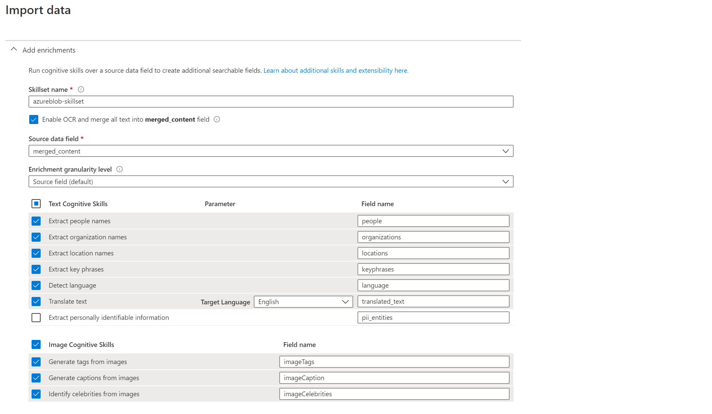

# Azure Portalで検索インデックスを作成する

以下の手順では、[データのインポートウィザード](https://docs.microsoft.com/azure/search/search-import-data-portal)を使用して、Azureポータルで検索インデックスを作成する手順を説明します。各手順の詳細については、[Blob Storageクイックスタート](https://docs.microsoft.com/azure/search/cognitive-search-quickstart-blob)を参照してください。

次のステップで起動するWebアプリは、適切に機能するためにいくつかのフィールドを受け取ることを期待しています。このため、セットアップ中に問題が発生しないように、以下に概説する要件に従ってください。

## 必要条件

Azure Portal経由でインデックスを作成する場合は、次の表の説明に従って検索フィールドのプロパティを設定します。

| フィールド					|用途と注意点						|
|-----------------------|-----------------------------------------------|
|content				| ファイルのトランスクリプトを表示するために使用されます。**searchable かつ retrievable** である必要があります。  |
|metadata_storage_path	| これは **key field** である必要があります。ストレージパスは、コンテンツのblobインデクサーにクエリを実行してファイルを「プレビュー」できるようにするために使用されます。**retrievable** である必要があります。**base64 encoded** されている場合は、必ずフロントエンドアプリケーションのファイル[appsettings.json](https://github.com/nohanaga/azure-search-knowledge-mining/tree/master/02%20-%20Web%20UI%20Template)で指定してください。		|
|metadata_storage_name	| ストレージ名は、結果ページにファイルの名前を表示するために使用されます。**retrievable** である必要があります。	|
|people					| ドキュメントで識別された人物の文字列のリスト。**facetable、filterable、searchable、retrievable** である必要があります。  |
|locations				| ドキュメントで識別された場所を含む文字列のリスト。**facetable、filterable、searchable、retrievable** である必要があります。  |
|organizations			| ドキュメントで識別された組織の文字列のリスト。**facetable、filterable、searchable、retrievable** である必要があります。  |
|keyPhrases				| ドキュメントで識別されたキーフレーズを含む文字列のリスト。**facetable、filterable、searchable、retrievable** である必要があります。  |

## 解説

以下の手順とスクリーンショットに従って、インデックスを作成します。

### 1.0 検索サービスに移動します

まず、Azureポータルで検索サービスに移動します。

### 2.0 データのインポートを選択します

### 3.0 データをインポートする

#### 3.1 Azure Blob Storageを選択します

#### 3.2 ウィザードに従ってストレージアカウントに接続します

### 4.0 Cognitiveスキルを追加する

#### 4.1 Cognitive Servicesをアタッチする

#### 4.2 エンリッチメントを追加する

#### 4.3 ナレッジストアへのエンリッチメントの保存

### 5.0 ターゲットインデックスをカスタマイズする

> **Note:** この手順は、インデックスを適切に構成するために不可欠です。 次のステップに進む前に、インデックスがスクリーンショットと同じになっていることを確認してください。

### 6.0 インデクサーを作成する

Congratulations! 次のフォルダに移動する準備がすべて整っているはずです。
